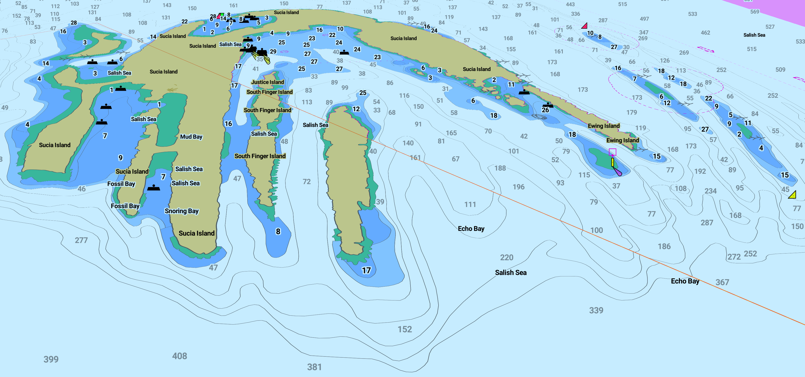

# Njord 

[](https://opensource.org/licenses/Apache-2.0)

## Status: This project is still very much a WORK IN PROGRESS.
Live Demo: https://openenc.com

<p>
    
    
</p>

### Marine Electronic Navigational Chart (ENC) Server

Njord consumes S-57 IHO transfer standard for digital hydrographic data. S-57 format chart data is published by 
hydrographic offices such as NOAA. https://www.charts.noaa.gov/ENCs/ENCs.shtml 

Njord displays ENC charts but does **NOT** strictly follow the IHO S-52 specifications for chart content and display.

S-52 display and S-57 data standards can be found here: https://iho.int/en/standards-and-specifications

----------

# Development System Requirements

* OpenJDK 17
* Gdal 3.6.2 **with Java bindings**
  * Note: Homebrew Gdal does not come with Java bindings and the osgeo tap is broken. 
          See [docs/gdal/README.md](docs/gdal/README.md) for building gdal from source with java via `brew`.
* PostGIS 13
  * See [chart_server_db/README.md](chart_server_db/README.md) for running PostGIS in a container for development. 

----------

# Local Development Quick Start

Bring up database
```shell
cd chart_server_db
docker-compose up
```

Bring up api
```shell
./gradlew :chart_server:run
```

Brin up front end with hot-reload
```shell
cd chart_server_fe
npm start
```

----------

# Docs

[System Design Notes](docs/DESIGN.md)
