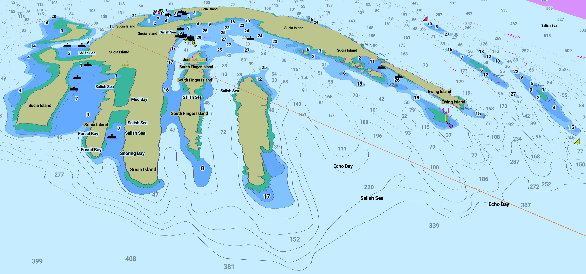

# Njord 


## Documentation

[Design documentation](docs/DESIGN.md)

[RELEASE_NOTES](./RELEASE_NOTES.md)

## Project Overview

Njord is a Marine Electronic Navigational Chart (ENC) server that ingests S-57 hydrographic chart files and serves them 
as MVT (Mapbox Vector Tiles). It does **not** strictly follow IHO S-52 display specifications. Live demo: https://openenc.com



## Build System

Gradle with Kotlin DSL. Use `./gradlew` at the root.

### Development Workflow

```bash
# 1. Start the database (PostGIS)
cd chart_server_db && podman-compose up

# 2. Build frontend
./gradlew :web:jsBrowserDistribution

# 3a. Run the API server (Kotlin/Native executable)
./gradlew :server:runDebugExecutable

# 3b. Option - build and run production
./gradlew :server:linkReleaseExecutableArch
CHART_SERVER_OPTS='{ "webStaticContent": "./web/build/dist/js/productionExecutable" }' \
./server/build/bin/arch/releaseExecutable/server.kexe ./server/src/nativeMain/resources

# 3c. Option - build and run in container
./gradlew makeImg
podman run --rm --network host ghcr.io/manimaul/njord-chart-server:<version>


# 4. Frontend with hot-reload (separate terminal)
./gradlew :web:jsBrowserDevelopmentRun --continuous
```

### Testing

```bash
# Run all tests
./gradlew allTests

# Run tests for a specific module
./gradlew :geojson:allTests
./gradlew :libgdal:allTests
./gradlew :server:allTests

# Run tests for a specific module and build target
./gradlew :geojson:jsTest
./gradlew :geojson:jsBrowserTest
./gradlew :geojson:archTest
./gradlew :geojson:jvmTest
```

### Containerization & Deployment

```bash
./gradlew :makeImg      # Build Podman image
./gradlew :pubImg       # Push image to registry
./gradlew :k8sApply     # Deploy to Kubernetes
./gradlew :deploy       # Full pipeline (build → push → deploy)
```

## Architecture

### Module Structure

| Module | Target | Purpose |
|--------|--------|---------|
| `server` | Kotlin/Native | HTTP server: ingestion, tile serving, API endpoints |
| `web` | Kotlin/JS | Compose frontend with MapLibre GL map |
| `shared` | Multiplatform (JVM/JS/Native) | Shared data models, serialization |
| `shared_fe` | Kotlin/JS | Frontend UI components, MapLibre bindings |
| `libgdal` | Kotlin/Native | C interop bindings to GDAL 3.6.2 |
| `libpq` | Kotlin/Native | C interop bindings to PostgreSQL client |
| `geojson` | Multiplatform | GeoJSON RFC 7946 implementation |

### Data Pipeline

1. **Ingestion**: User uploads a zip of S-57 `.000` files via the web UI
2. **Processing**: `server/src/nativeMain/kotlin/ingest/ChartIngest.kt` reads files via GDAL (`libgdal`), extracts chart metadata and features, converts all geometries to WGS84 (EPSG:4326), stores as GeoJSON FeatureCollections in PostGIS
3. **Tile serving**: On tile request, `TileEncoder` queries PostGIS for charts and features within the tile envelope, clips geometries, and encodes as protobuf MVT
4. **Styling**: Each S-57 object class has a corresponding layer class in `server/src/nativeMain/kotlin/layers/` that defines Mapbox GL style rules. The `TileEncoder` adds symbol properties (e.g., `SY`) to feature properties so the style JSON can reference them via `["get","SY"]`.

### Key Files in `server`

- `Main.kt` — entry point; initializes GDAL, database, HTTP server
- `geo/TileEncoder.kt` — MVT tile assembly
- `ingest/ChartIngest.kt` — S-57 file processing pipeline
- `layers/` — one file per S-57 object class (e.g., `Depare.kt`, `Soundg.kt`, `Boyspp.kt`)
- `endpoints/` — HTTP/WebSocket route handlers

### Database

PostgreSQL 13 + PostGIS. For development, run via Podman Compose in `chart_server_db/`. The `features` table stores GeoJSON FeatureCollections indexed by chart coverage polygon for spatial queries.

## System Requirements

- **openjdk-17-jre-headless** — required for Gradle and Kotlin/Native toolchain
- **libgdal-dev** — Geospatial Data Abstraction Library - Development files
- **libpq-dev** - header files for libpq5 (PostgreSQL library)
- **PostGIS 13** — run in Podman for development (see `chart_server_db/README.md`)

## Important Notes

- **GitHub Packages** authentication uses `GH_USER` and `GH_TOKEN` environment variables
- The `docs/DESIGN.md` links reference an older JVM implementation; the current codebase is Kotlin/Native
- Platform targets: macOS x64/ARM64, Linux x64/ARM64 (backend), JS (frontend / browser) 
- Targets not used: Windows x64 (Native)

## Development on MacOS

Required packages
```shell
brew install gdal libpq gd libzip openssl@3 openjdk@21
```

Useful packages 
```shell
brew install podman podman-compose
```

You'll need to set memory to at leas 8192 to build container image(s) 
```shell
podman machine set --memory 8192 
```
