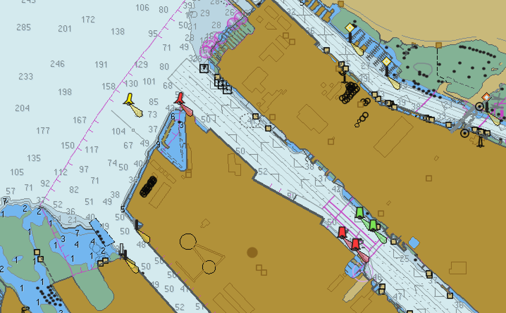

# Rendering Map Tiles - Design Doc

The goal is to render MVT (Mapbox Vector Tiles) starting from S57 files published by hydrographic agencies and apply a mapbox theme that results in a map display such as this example from [OpenCPN](https://opencpn.org/): 


We will start by using [GDAL](https://gdal.org/) to read the s57 file geometries and meta data. Then save to a [Sqlite](https://www.sqlite.org/index.html) database. 

Steps:
- calculate the optimal z-index based on the S57 published scale
- as s57 files are added to the system only the `files` table will be populated. 
- `features` and `feature_geometries` will be lazily evaluated.
    - iterate s57 features, layers and save wgs84 transformed geometry [WKT](https://en.wikipedia.org/wiki/Well-known_text_representation_of_geometry) to database using the schema below 

Life of a tile query option 1:
- stage 1
    - `tile_cache` is queried first for MVT blob and returns early with render if it exists
- stage 2
    - `files` table is queried for ids containing tile coords
    - files are opened via gdal 
        - each layer is clipped to tile bounds
        - geometry coordinates are transformed to wgs84 if needed
        - wkt or wkb is extracted 
        - layer name and feature attributes needed for theming are extracted
        - tile meta data can point to s57 file , layer and feature index
        - tile is rendered and cached
    
Life of a tile query option 2:
- stage 1
    - `tile_cache` is queried first for MVT blob and returns early with render if it exists
- stage 2
    - `files` table is queried for ids containing tile coords
    - if all file.full_vals are true then we proceed to stage 3
    - (needs more detail) on the fly render just what you need and bg process the rest 
- stage 3
    - query feature_geometries using tile coords
    - if tile is empty search up quad tree 1 and then down up to 6 levels clipping geometries to suit
    - construct MVT in layer prioritized order from resulting geometries and cache tile render

Questions:
- Can we extract the geometries straight from the s57 files and still be performant?
    - This would allow us to skip having `features` and `feature_geometry` tables altogether.
- Do we want to use and [R*Tree enabled sqlite](https://www.sqlite.org/rtree.html)?

Todo:
- document s57 files added / removed from system
- document s57 mapbox theme and sources

# Geometry DB Schema

```sqlite
CREATE TABLE files (
    id          INTEGER PRIMARY KEY AUTOINCREMENT,
    name        TEXT,
    file        TEXT,    -- local path to file
                         -- http://www.naturalearthdata.com/downloads/10m-physical-vectors/
    type        INTEGER, -- 0 (s57), 1 (future), 2 (shp coastline), 3 (shp islands), 4 (shp reefs), 5 (shp ocean)
    md5sum      TEXT,
    depths      TEXT,
    soundings   TEXT,
    datum       TEXT,
    projection  TEXT,
    updated     TEXT,
    scale       INTEGER,
    z           INTEGER, -- optimal tile z index calculated from scale
    min_x       INTEGER, -- min tile x
    max_x       INTEGER, -- max tile x
    min_y       INTEGER, -- min tile y
    max_y       INTEGER, -- max tile y
    outline_wkt TEXT,    -- chart outline geometry LineString as WKT
    full_eval   INTEGER  -- 
);
CREATE INDEX idx_features ON files (z, min_x, max_x, min_y, max_y);

CREATE TABLE features (
    id     INTEGER PRIMARY KEY AUTOINCREMENT,
    fid    INTEGER,
    FOREIGN KEY(fid) REFERENCES files(id), 
    z      INTEGER,
    min_x  INTEGER,
    max_x  INTEGER,
    min_y  INTEGER,
    max_y  INTEGER,
    name   TEXT,    -- s57 acronym eg. BOYSPP (gdal layer name)
    attrs  TEXT     -- s57 attributes as json - http://www.s-57.com/
);
CREATE INDEX idx_features ON features (z, min_x, max_x, min_y, max_y);

CREATE TABLE feature_geometries (
    fid    INTEGER, -- feature id 
    FOREIGN KEY(fid) REFERENCES features(id), 
    z      INTEGER, 
    x      INTEGER,
    y      INTEGER,
    wkt    TEXT     -- geometry WKT (exceptions: `f` and `e` for full and empty tiles respectively)
);
CREATE INDEX idx_feature_geometries ON feature_geometries (z, x, y);
```

```sqlite
CREATE TABLE tile_cache (
    zxy TEXT,
    vt  BLOB
);
CREATE INDEX idx_tile_cache ON tile_cache (zxy);
```


# Glossary 
#### MVT
[Mapbox Vector Tiles Specification](https://docs.mapbox.com/vector-tiles/specification/)
MVTs are encoded and indexed geometries and meta data useful for drawing maps.

#### S57 
> S-57 is the data format used for the transfer of digital hydrographic data between national hydrographic offices and for 
> ​its distribution to manufacturers, mariners and other data users. Within this standard, the S-57 ENC product specification 
> defines how hydrographic offices will construct an Electronic Navigational Chart. By meeting these specifications 
> hydrographic offices will ensure that all electronic charts contain all the chart information that is necessary for safe 
> navigation. 
https://www.admiralty.co.uk/news/blogs/s-57-and-the-latest-iho-standards
[s25-standard-ed6.1.1](./s52-standard-ed6.1.1.pdf)


